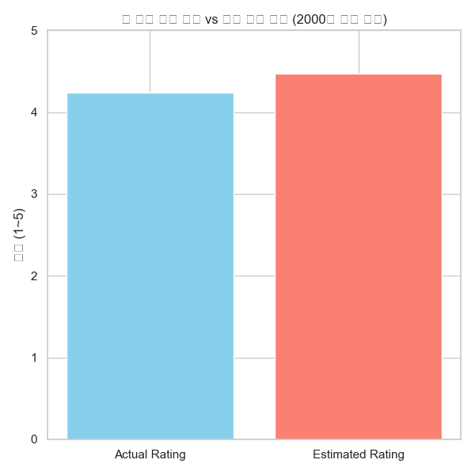
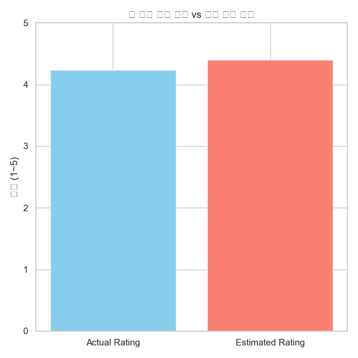
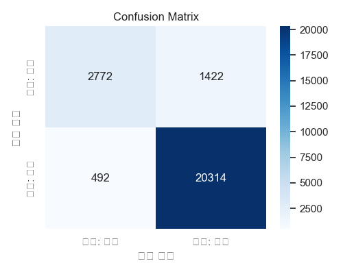

# **Hotel Reviews Sentiment Analysis**

  
  
  


## 📚 목차
1. [프로젝트 개요](#📜-프로젝트-개요)
2. [기술 스택](#🧑‍💻-기술-스택)
3. [원시 데이터](#2-원시-데이터)
4. [데이터셋 설명](#📊-데이터셋)
5. [실행 방법](#⚙️-실행-방법)
6. [모델 파인튜닝](#🧠-모델-파인튜닝-과정)
7. [모델 예측 및 결과](#📈-분석-결과)
8. [시각화](#📸-시각화-결과)
9. [개선 방안](#🚀-개선-방안)
10. [결론](#🚀-결론과-유출-가능한-추론)
11. [참고 문서](#🔗-참고-문서)


---

## **📜 프로젝트 개요**

이 프로젝트는 **호텔 리뷰 데이터셋**을 기반으로 리뷰 텍스트로부터 **긍정/부정 감성**을 예측하고, 이를 통해 전체 리뷰의 평균 평점과 모델이 예측한 평점 간의 관계를 분석합니다.

Google의 MobileBERT 모델을 **직접 파인튜닝**하여 감성 분류에 활용하고, 예측된 긍정 비율로부터 **예상 평점**을 도출합니다.

---

## **🧑‍💻 기술 스택**

- **Python**: 주요 프로그래밍 언어
- **PyTorch**: 딥러닝 모델 학습 및 추론
- **Transformers (Hugging Face)**: MobileBERT 사전 학습 모델 및 Trainer API
- **Pandas / NumPy**: 데이터 처리 및 분석
- **Matplotlib / Seaborn**: 시각화 도구

---

## **2. 원시 데이터**

- [호텔 리뷰 데이터셋 (TripAdvisor)](https://www.kaggle.com/datasets/arnabchaki/tripadvisor-reviews-2023)

---

## **📊 데이터셋**

- **파일명**: `cleaned_sampled_12_reviews_final.csv`
- **주요 컬럼**:
  - `review_full`: 리뷰 텍스트
  - `rating_review`: 사용자 평점 (1~5)
  - `Label`: 감정 라벨 (1 = 긍정, 0 = 부정)

---

## **⚙️ 실행 방법**

### 1. 라이브러리 설치
```bash
pip install torch transformers pandas numpy matplotlib seaborn tqdm

```
---

### 1_1. 의존성 설치
```bash
pip install torch==1.9.0 transformers==4.30.2 pandas numpy matplotlib seaborn tqdm

```
---


###  2. 디바이스 설정
사전 세팅
Device 설정: GPU를 사용할 수 있으면 CUDA를 이용하고, 그렇지 않으면 CPU를 사용합니다.

```bash
device = torch.device("cuda" if torch.cuda.is_available() else "cpu")
print(f"Using device: {device}")
```
---

### 3. 데이터 로드 및 라벨링
CSV 파일을 로드하고, 결측치를 제거한 후, Rating을 실수형으로 변환하고, 긍정/부정 라벨링을 진행합니다.
```bash
df = pd.read_csv("cleaned_sampled_12_reviews_final.csv")
df["rating_review"] = df["rating_review"].astype(float)
df["Label"] = df["rating_review"].apply(lambda x: 1 if x > 3 else 0)
```
---


### 4. 모델 로드
Google의 사전 학습된 MobileBERT(`google/mobilebert-uncased`) 모델을 호텔 리뷰 감성 분석에 맞게 파인튜닝하였습니다.  
이후, 학습된 모델을 이용해 전체 리뷰 데이터에 대해 긍정/부정 예측을 수행합니다.

```bash
model = MobileBertForSequenceClassification.from_pretrained("mobilebert_finetuned_2k")
tokenizer = MobileBertTokenizer.from_pretrained("mobilebert_finetuned_2k")
model.to(device)
model.eval()
```
---
### 4_1)🧠 모델 파인튜닝 과정
Google의 사전 학습 모델 **google/mobilebert-uncased**를 기반으로, 감정 분류 목적에 맞게 파인튜닝을 수행했습니다.
학습 데이터 2,000개 샘플을 사용하여 3 에폭 동안 MobileBERT를 파인튜닝했습니다.


학습 데이터: 2,000개 샘플 (긍정/부정 라벨링)

검증 데이터: 학습 데이터의 10%

에폭: 3

배치 크기: 8

최대 토큰 길이: 256

Trainer API 활용


데이터 분할:

학습: 90%

검증: 10%

라벨 기준:

평점 > 3: 긍정 (1)

평점 ≤ 3: 부정 (0)


사용 라이브러리: transformers.Trainer // ReviewDataset 사용자 정의 클래스

훈련된 모델과 토크나이저는 mobilebert_finetuned_drug/ 디렉토리에 저장 후 추론에 활용했습니다.

----

## 5. 리뷰 예측
리뷰 텍스트를 토크나이징하여 모델에 입력하고, 각 리뷰에 대해 긍정/부정 예측을 수행합니다.
```bash
inputs = tokenizer(texts, truncation=True, padding="max_length", max_length=256, return_tensors="pt")
```
---

## 6. 지점별 평점 계산
각 지점별로 실제 평점의 평균을 계산하고, 예측된 긍정 비율을 기반으로 예상 평점을 계산합니다.
```bash
actual_ratings = grouped["Rating"].mean()
positive_ratio = grouped["Predicted"].mean()
estimated_ratings = positive_ratio * 4 + 1
```
---


## 7.상관계수 계산
실제 평점과 예측 평점 간의 상관관계를 계산하여 신뢰도를 분석합니다.
```bash
correlation = result["Actual_Avg_Rating"].corr(result["Estimated_Rating"])
```
---


## 8. 시각화
실제 평점과 예상 평점 간의 관계를 시각화하여 직관적으로 비교할 수 있습니다.
```bash
sns.scatterplot(x="Actual_Avg_Rating", y="Estimated_Rating", data=result, hue=result.index)
```
---


## 9. 📈 분석 결과
상관계수 분석
상관계수: 실제 평점과 예측 평점 간의 상관관계를 계산하여, 예측 모델의 신뢰도를 분석합니다.

상관계수 > 0.75: 신뢰도가 높음

상관계수 0.4 ~ 0.75: 중간 정도의 신뢰도

상관계수 < 0.4: 신뢰도가 낮음

| 상관계수 범위 | 신뢰도 수준     |
|---------------|----------------|
| > 0.75        | 매우 높음       |
| 0.4 ~ 0.75    | 중간 수준       |
| < 0.4         | 낮음           |

---

### 9_1) 📈 분석 결과
파인튜닝된 MobileBERT 모델을 사용하여 전체 리뷰 데이터에 대해 예측을 수행하고, 아래와 같은 결과를 얻었습니다.

⭐ 전체 실제 평균 평점: 4.24
🤖 전체 예측 기반 평점: 4.48
📊 전체 긍정 리뷰 비율: 86.94%
🔍 예측 라벨 분포: Counter({1: 21736, 0: 3264})

### ✅ 정확도 (Accuracy): 92.34


📋 분류 리포트 (Classification Report):
```bash
              precision    recall  f1-score   support

          부정       0.85      0.66      0.74      4194
          긍정       0.93      0.98      0.96     20806

    accuracy                           0.92     25000
   macro avg       0.89      0.82      0.85     25000
weighted avg       0.92      0.92      0.92     25000
```


🔍 혼동 행렬 (Confusion Matrix):
[[ 2772  1422]
[  492 20314]]

---

예측 평점은 다음 방식으로 산출됩니다:


```bash
estimated_rating = positive_ratio * 4 + 1
```
이 방식은 긍정 비율을 기반으로 1~5 사이의 예상 평점을 도출하는 선형 추정 방식입니다.

---


## 10. 📸 시각화 결과


```bash
sns.set(style="whitegrid")
plt.bar(["Actual Rating", "Estimated Rating"], [actual_avg_rating, estimated_rating], color=["skyblue", "salmon"])
plt.ylim(0, 5)
plt.title("📈 전체 실제 평점 vs 예측 기반 평점")
```
 지점별 실제 평점과 예측 평점 간의 관계를 나타낸 산점도입니다.

지점별 실제 평점과 예상 평점의 관계를 시각화하여, 모델 예측이 실제 평점과 어느 정도 일치하는지 확인할 수 있습니다.

## 10_1)  전체 데이터셋 (2000개 샘플 기준)

전체 학습용 2000개 샘플의 실제 평균 평점과 MobileBERT 모델이 예측한 평점 간 비교입니다.


----

## 10_2) 전체 리뷰 데이터셋 (샘플링 이후 전체)

전체 리뷰 데이터셋에 대한 실제 평점과 모델 기반 예상 평점 비교



----

## 10_3) Confushion Matrix



## 11. 🚀 개선 방안
클래스 불균형 처리: 긍/부정 리뷰 비율이 불균형할 경우, oversampling / undersampling 또는 가중치 조정 필요

정규화된 다중 클래스 평점 예측: 1~5 점수를 그대로 예측하는 방식으로 확장 가능

다양한 사전 학습 모델 실험: DistilBERT, RoBERTa 등 비교 실험

Branch (지점) 별 분석: 지점별 예측 정확도 분석 및 개선


---
## 12. 🚀 결론과 유출 가능한 추론

본 프로젝트는 MobileBERT를 효과적으로 파인튜닝하여 호텔 리뷰의 긍정/부정 감성을 예측하였고, 모델 예측 기반 평점이 실제 평점과 근접함을 확인했습니다.
이는 리뷰 기반 고객 만족도 모니터링, 자동화된 서비스 품질 평가 등에 활용 가능함을 시사합니다. 또한 데이터의 신뢰성을 바탕으로 다양한 2차적**활용**또한 시도해 봄 직합니다.

---
## 🔗 참고 문서
Hugging Face Transformers Documentation

PyTorch Documentation

### 추가된 배지 설명:

1. **Python 버전 배지**: Python 3.9 버전을 나타내는 배지
2. **PyTorch 배지**: PyTorch 1.9.0 버전 배지
3. **Hugging Face 배지**: Hugging Face의 Transformers 라이브러리 배지
4. **라이센스 배지**: MIT 라이센스 배지


